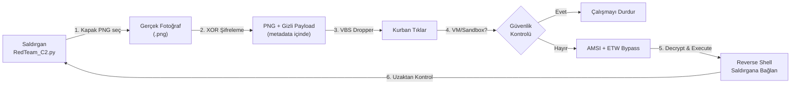

# 🛡️ The Ultimate Pentest Arsenal

[](https://opensource.org/licenses/MIT)
[](https://www.python.org/)
[]()

Hoş geldiniz! Bu proje, siber güvenlik, sızma testi (penetration testing) ve "Red Team" (Saldırı Takımı) operasyonlarında kullanılan araçların **tek bir merkezde** toplandığı profesyonel bir cephaneliktir.

Bilgisayar korsanlarının kullandığı yöntemleri öğrenmek, kendi sistemlerinizdeki açıkları bulmak ve bu saldırılara karşı nasıl korunacağınızı anlamak için tasarlandı.

> ⚠️ **YASAL UYARI:** Bu araçlar **YALNIZCA EĞİTİM** ve yetkili (izinli) güvenlik testleri içindir. Başkalarına ait sistemlerde izinsiz kullanmak yasa dışıdır.

---

## 🎯 Bu Araç Setiyle Neler Yapabilirsiniz?

Eskiden karmaşık komutlar yazmanız gereken işlemleri, artık tek bir `RedTeam_C2.py` dosyasını çalıştırarak renkli bir menü üzerinden seçebilirsiniz. Menümüz **Riske Göre Sıralanmıştır**: En güvenli araçlardan (bilgi toplama), en tehlikeli araçlara (sistem ele geçirme) doğru ilerler.

### 🟢 Düşük Riskli Araçlar (İz Bırakmaz, Kontrol Amaçlıdır)
Sistemde değişiklik yapmazlar, sadece açık ararlar.
*   **Privilege Escalation (Yetki Yükseltme Kontrolü):** Sisteme normal bir kullanıcı olarak girdikten sonra, "Yönetici" (Admin/Root) olup olamayacağınızı kontrol eder. Sistemin röntgenini çeker.
*   **AV Evasion (Antivirüs Atlatma):** *(Not: C2 Framework zaten kendi içinde antivirüs atlatma kullanır. Ancak bu bölümdeki kodlar, kendi yazdığınız özel virüs kodlarını şifreleyerek Antivirüslerden saklamanıza yarar.)*

### 🟡 Orta Riskli Araçlar (Tarayıcılar ve Kırıcılar)
Hedef ağa istek gönderirler, dikkatli incelenirse fark edilebilirler.
*   **Network Recon (Ağ Keşfi):** Aynı ağa bağlı diğer cihazları bulur, web sitelerinin gizli alt alan adlarını (subdomain) tespit eder ve "Ortadaki Adam" (ARP Spoofing) saldırısı yapar.
*   **Web Exploitation (Web Hackleme):** Web sitelerinde en çok karşılaşılan "SQL Injection" veya "XSS" gibi hataları bulmanızı sağlar.
*   **Password Cracking (Şifre Kırma):** Elde ettiğiniz şifrelenmiş metinleri (hash) veya kilitli ZIP dosyalarını, bir kelime listesi (wordlist) kullanarak deneme-yanılma yoluyla kırar. Ayrıca SSH ve FTP sunucularına zorla girmeyi dener.

### 🔴 Yüksek Riskli Araçlar (İstismar ve Ele Geçirme)
Sisteme doğrudan müdahale eder, kalıcı izler bırakabilir.
*   **Post-Exploitation (Ele Geçirme Sonrası):** Bilgisayara sızdıktan sonra çalışan araçlardır. Arka planda gizlice çalışıp **klavye vuruşlarını kaydeder** (Keylogger), **düzenli ekran görüntüsü alır** ve kayıtlı WiFi şifrelerini çalar. Bilgisayar kapansa bile tekrar açıldığında çalışmaya devam eder (Kalıcılık - Persistence).
*   **C2 Framework (Gizli Virüs ve Dinleyici):** Bu projenin kalbidir! Bilgisayarı uzaktan yönetmenizi sağlar.

---

## 📸 Görünüm ve Kullanım

Kullanımı çok basittir. Terminalinizi/CMD'yi açıp şu komutu yazmanız yeterlidir:

```bash
python RedTeam_C2.py
```

Karsınıza aşağıdaki gibi renkli bir menü ekranı çıkacak:

```
┌──────────────────────────────────────────────────┐
│  The Ultimate Pentest Arsenal v5.0     │
│                                        │
│  RİSK BİLGİLENDİRMESİ:                  │
│  ■ DÜŞÜK RİSK  : Tespit/Kontrol           │
│  ■ ORTA RİSK   : Tarayıcı/Bruteforce      │
│  ■ YÜKSEK RİSK : İstismar/C2              │
│                                        │
│  1) Privilege Escalation               │
│  2) AV Evasion                         │
│  3) Network Recon                      │
│  4) Web Exploitation                   │
│  5) Password Cracking                  │
│  6) Post-Exploitation                  │
│  7) C2 Framework                       │
│  0) Çıkış                                │
└──────────────────────────────────────────────────┘
```

Riske göre ayrılmış kategorilerden klavyenizle numara seçerek ilerleyebilirsiniz.

---

## 🕵️‍♂️ "Steganografik PNG Virüsü" Nasıl Çalışır? (C2 Framework)

C2 (Command and Control) Framework, kurban bilgisayarı uzaktan komuta etmenize yarar. Biz bu araçta çok gelişmiş bir teknik olan **Steganografi (Resim içine veri gizleme)** tekniğini kullanıyoruz.

1.  **Menüden 7'yi ve ardından 1'i seçin:** Sizden masum bir `.png` (fotoğraf) dosyası istenecek.
2.  **Şifreleme:** Yazılımımız, yazdığımız virüs kodunu (Reverse Shell) alıp **XOR algoritmasıyla şifreler**. Böylece antivirüs programları kodun içine baksa bile anlamsız karakterler görür.
3.  **Resme Gömme:** Şifreli bu kod, verdiğiniz fotoğrafın gözle görünmeyen teknik bölgelerine (`tEXt` metadata) gizlenir. *Fotoğraf bozulmaz, tıklandığında hala normal bir fotoğraf gibi açılır.*
4.  **Dropper (Tetikleyici):** Sistem size bu PNG'nin yanında bir `.vbs` (Visual Basic Script) dosyası verir.
5.  **Güvenlik Aşma (AV Evasion):** Kurban `.vbs` dosyasına tıkladığında:
    *   Önce kurbanın ekranında **fotoğraf normal şekilde açılır** (şüphe çekmez).
    *   Arka planda bilgisayarın bir "Sanal Makine (VM)" veya "Güvenlik Laboratuvarı (Sandbox)" olup olmadığını kontrol eder. Eğer öyleyse çalışmayı durdurur.
    *   Windows'un yerleşik koruması olan **AMSI** sistemini devre dışı bırakır.
    *   Fotoğrafın içindeki şifreli kodu çözer ve kurbanın bilgisayarıyla sizin aranızda **gizli bir bağlantı kurar.**



Artık kurbanın bilgisayarına uzaktan istediğiniz komutu gönderebilirsiniz!

---

## ⚙️ Kurulum

Projeyi çalıştırmak için bilgisayarınızda Python yüklü olmalıdır. Ardından bazı kütüphaneleri indirmeniz gerekir:

```bash
# Proje klasörüne girin
cd Pentest-Cheatsheet-master

# Gerekli yan paketleri kurun
pip install -r requirements.txt
```

Artık `python RedTeam_C2.py` yazarak bu gücü kontrol edebilirsiniz. Güvenle ve etik kurallar çerçevesinde kullanın!
