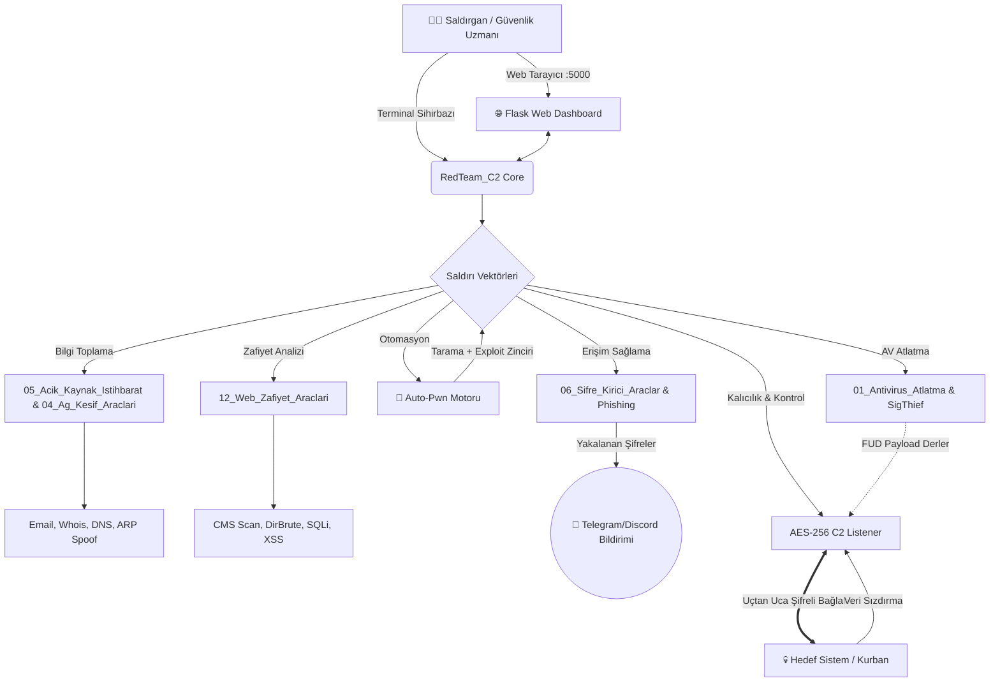

<div align="center">

# 💀 The Ultimate Pentest Arsenal (RedTeam C2)

**Profesyonel, Hepsi Bir Arada Siber Güvenlik, Otomasyon ve Kırmızı Takım (Red Team) Aracı**

[](https://python.org)
[](LICENSE)
[]()
[]()
[]()

*Bu proje yalnızca eğitim, sızma testi (pentest) yetkilendirmesi olan profesyoneller ve etik hackerlar (White Hat) için geliştirilmiştir.*

---

</div>

## 📖 Proje Hakkında

**The Ultimate Pentest Arsenal**, dağınık haldeki siber güvenlik araçlarını (Nmap, DirBuster, Hydra, Metasploit vb. işlevlerini) tek bir merkezden, **Karanlık Mod (Dark Mode) Web Dashboard** veya **Terminal Sihirbazı** aracılığıyla yönetmenizi sağlayan devasa bir Red Team otomasyon aracıdır.

Sıfırdan tasarlanan **Askeri Düzey AES-256 Şifreli C2 (Command & Control)** mimarisi sayesinde, oluşturduğunuz Zararlı Yazılımlar (Payloads) hedef ağdaki modern Firewall ve IDS sistemlerini kolayca atlatır (Bypass). 

## 🚀 Öne Çıkan "Elite" Özellikler

- **🤖 Auto-Pwn (Otopilot):** Tek bir IP adresi verin, arkaya yaslanın. Araç kendi kendine portları tarar, bulduğu servislere (HTTP, FTP, SSH) uygun zafiyet araçlarını zincirleme çalıştırır ve raporu sunar.
- **👻 01_Antivirus_Atlatma & SigThief (0-Day Stealth):** Nuitka C derlemesi ve **SigThief (Dijital İmza Çalma)** sayesinde Microsoft imzalarını kopyalayarak EDR ve Anti-Virüsleri (0/70 FUD oranı) tamamen atlatın.
- **🌐 Glassmorphism Web Dashboard:** 26 farklı sızma testi aracını, komut satırı ezberlemeden, şık ve dinamik bir web tarayıcı arayüzünden yönetin.
- **🔒 AES-256 E2EE C2 Bağlantısı:** Hedef cihazlarla aranızdaki Reverse Shell iletişimi uçtan uca AES-256 ile şifrelenir. 
- **📱 Telegram & Discord Entegrasyonu:** Şifre mi kırıldı? Biri Phishing ağına mı düştü? Yoksa C2'ye yeni bir shell mi bağlandı? Sistem anında cebinize bildirim gönderir.

---

## 🏗️ Mimari Şeması (Architecture)

Aşağıdaki şema, projenin devasa modül ağının birbiriyle nasıl entegre haberleştiğini göstermektedir:



---

## 🧰 Modüller ve İçerikleri

Proje içerisinde **26+** modül mükemmel bir uyumla çalışmak üzere kategorize edilmiştir:

| Kategori | Araçlar | Açıklama |
| :--- | :--- | :--- |
| **05_Acik_Kaynak_Istihbarat** | `Email_Harvester`, `Whois_Lookup` | Alan adları ve hedefler hakkında açık kaynaklardan veri toplar. |
| **04_Ag_Kesif_Araclari** | `Network_Scanner`, `DNS_Enumerator`, `ARP_Spoofer` | LAN üzerinde cihaz tespiti, DNS analizi ve ağ trafiğini manipüle etme (MITM). |
| **12_Web_Zafiyet_Araclari** | `CMS_Scanner`, `DirBrute`, `SQLi`, `XSS`, `LFI` | Web sunucularındaki kritik zafiyetleri ve gizli dosyaları analiz eder. |
| **06_Sifre_Kirici_Araclar** | `SSH_Brute`, `FTP_Brute`, `Hash_Cracker`, `Zip_Cracker` | Kritik servislere ve dosyalara yönelik kaba kuvvet saldırıları düzenler. |
| **10_Sosyal_Muhendislik**| `Phishing_Server` | Modern, log tutan ve bildirim gönderen sahte oltalama sunucusu. |
| **01_Antivirus_Atlatma** | `SigThief`, `Payload_Obfuscator`, `Shellcode_Encoder` | Güvenlik duvarlarını ve Antivirüsleri atlatmak için sertifika kopyalama (SigThief) ve kod gizleme araçları. |
| **C2 & Post-Exploit** | `Payload_Builder`, `C2_Listener`, `Ransomware`, `Keylogger` | Antivirüslere yakalanmayan, hedef ağı içeriden yöneten E2EE kontrol merkezi. |

---

## 💻 Kurulum ve Çalıştırma

The Ultimate Pentest Arsenal, tüm bağımlılıkları tek tuşla kurabilmeniz için özel scriptler içerir.

### Windows İçin
Dizindeki **`kurulum.bat`** dosyasına çift tıklayın veya terminalde çalıştırın:
```cmd
kurulum.bat
```

### Linux (Kali / Parrot) İçin
Terminali açın ve şu komutları girin:
```bash
chmod +x install.sh
./install.sh
```

### Projeyi Başlatma (Ana Menü)
Tüm araçları yöneteceğiniz merkezi çalıştırmak için:
```bash
python Komuta_Kontrol_Merkezi_C2.py
```

Bu komuttan sonra karşınıza çıkan sihirbazdan:
- İstediğiniz aracı seçip **Terminal Sihirbazı** üzerinden parametreleri adım adım girebilirsiniz.
- Veya menüden **"13) Web Dashboard"** seçeneğini seçerek tarayıcınızdan muhteşem **Glassmorphism grafik arayüzüne** bağlanabilirsiniz!

---

## ⚙️ Bildirim Ayarları (Config)

Projedeki oltalama (Phishing), otopilot (Auto-Pwn) veya yeni C2 kurban bağlantıları sırasında cebinize bildirim gelmesini istiyorsanız, proje dizininde oluşan `config.json` dosyasını şu şekilde düzenleyin:

```json
{
    "telegram_bot_token": "123456789:ABCdefGHIjklMNOpqrs",
    "telegram_chat_id": "12345678",
    "discord_webhook": "https://discord.com/api/webhooks/...",
    "notifications_enabled": true
}
```

---

## ⚠️ Yasal Uyarı

Bu proje **sadece** sistem yöneticileri, sızma testi (penetration testing) uzmanları ve siber güvenlik öğrencileri için eğitim/savunma amacıyla tasarlanmıştır.

Bu araç setinin izin alınmamış sistemler (kurumlar, kişiler veya sunucular) üzerinde kullanılması **yasa dışıdır**. Geliştirici, bu kodların kötüye kullanımından doğacak yasal veya cezai hiçbir sorumluluğu kabul etmez. Kullanıcı, aracı kullanırken bulunduğu ülkenin bilişim yasalarına uymakla yükümlüdür.

<div align="center">
  <br>
  <i>"Güvenlik bir yanılsama değil, sürekli bir savunma halidir."</i>
</div>
